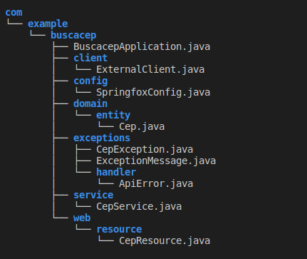
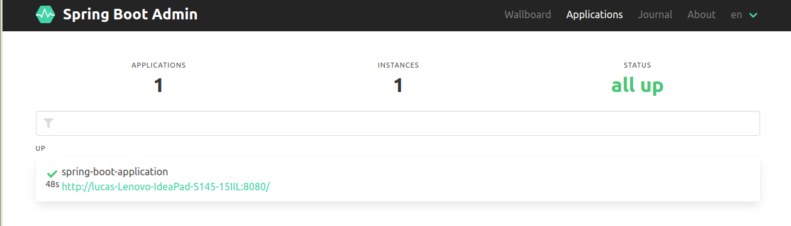
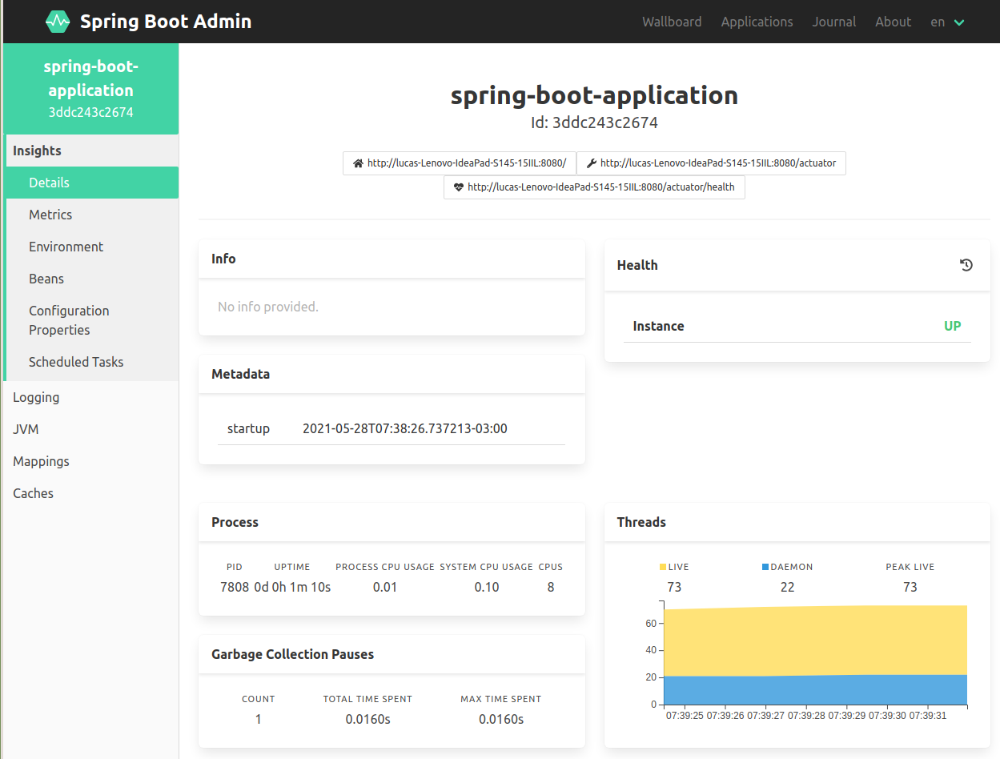
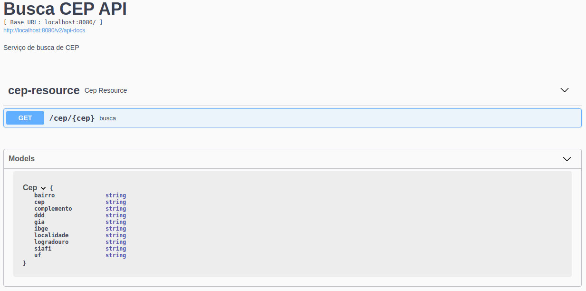

# Sistema de buscar CEP

[](https://travis-ci.org/codecentric/springboot-sample-app)
[](http://www.apache.org/licenses/LICENSE-2.0.html)


Esse projeto possui  dois projetos base que são um projeto de administração e monitoramente de microserviços usando o **Spring Boot Admin Server** e **Spring Boot Admin Client**, respectivamente, **adminserver**  e  **buscacep**
## Requisitos

* JDK 11
* Maven 3.6.3


## Arquitetura 

Utilizamos uma arquitura de microserviços com o microserviço **buscacep** e sendo monitorado pelo serviço **adminserver**

### Busca CEP 

A estrutura de pastas para o microserviço **buscacep** tende adotar uma arquitetura limpa.




## Subir aplicação


### Admin Server
```shell
cd ../adminserver
./mvnw
```
Abrir [Admin server](http://localhost:8081/):





### Busca CEP
```shell
cd ../buscacep
./mvnw
```
Abrir [Busca CEP](http://localhost:8080/swagger-ui/):




## Testes

### Busca CEP 
```shell
cd ../buscacep
./mvnw test
```


## Copyright

Released under the Apache License 2.0. See the [LICENSE](https://github.com/LucasPLopes/busca-cep/blob/master/LICENSE) file.